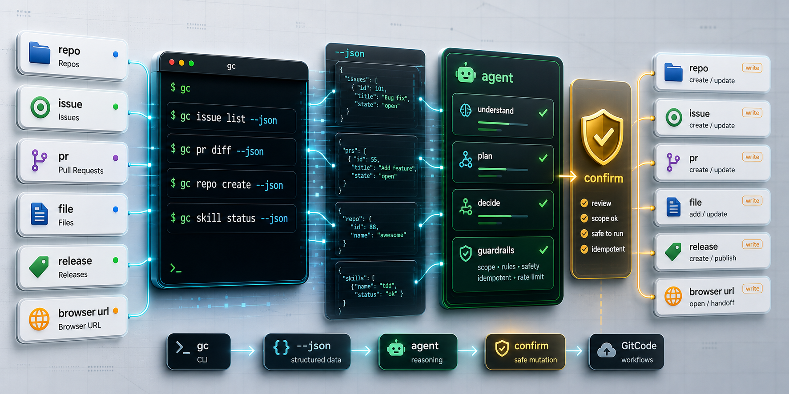

# gitcode-cli

简体中文 | [English](#english)

面向工程师和 AI Agent 的 GitCode 自动化 CLI：用接近 GitHub CLI (`gh`) 的命令形态，把仓库、Issue、Pull Request、文件、Release、认证、JSON 输出和浏览器跳转变成稳定、可脚本化、适合 Agent 调用的工作流。

[安装](#安装) · [认证](#认证) · [Agent Skill](#agent-skill) · [常用工作流](#常用工作流) · [测试](#测试) · [English](#english)

## 项目定位

`gitcode-cli` 是一个 scriptable、agent-ready 的 GitCode 命令行工具。它不是完整的 GitCode 桌面替代品，也不是 `toads/gitcode-cli` 的克隆；本项目更关注自动化场景里的稳定合同：熟悉的 `gh` 风格命令、可预测的 JSON 字段、低惊讶的变更操作，以及给 AI Agent 使用的安全默认值。

`web2cli` harness 仍然随包保留，作为把 Web 应用分析并生成 Agent 友好 CLI 的次级能力；但 README 和日常使用主线聚焦在 GitCode CLI。

## 适合做什么

| 场景 | 能力 |
| --- | --- |
| 仓库自动化 | 查看、克隆、创建、fork、同步仓库，设置默认仓库上下文。 |
| Issue / PR 工作流 | 列表、查看、创建、编辑、评论、关闭、重开、checkout、diff、merge。 |
| 文件和 Release | 浏览仓库文件，查看文件内容，管理 label 和 release。 |
| 账号和组织 | 登录、Token 状态、组织仓库、成员、SSH key 管理。 |
| JSON 和脚本 | `--json`、`--jq`、`--template`、`gc api`，方便脚本和 CI 解析。 |
| Agent 安全自动化 | 通过 `skills/gitcode-cli` 指导 Agent 先读后写、显式确认破坏性操作、优先稳定 JSON 输出。 |
| 浏览器交接 | `gc browse` 打开或打印 GitCode URL，适合人机协作。 |

## 安装

从仓库安装：

```bash
npm install
npm run build
npm link
gc --version
gitcode --version
```

从已发布 npm 包安装：

```bash
npm install -g @plm-cac/gitcode-cli
gc --help
```

如果你希望 Codex 或其他支持 filesystem skill 的 Agent 更稳定地使用这个 CLI，可以在 CLI 可用后安装配套 skill：

```bash
gc skill status
gc skill install
```

非交互 Agent 会话应先检查状态、向用户确认，再执行安装：

```bash
gc skill status --json
gc skill install --yes
```

## 认证

交互式登录会在 stderr 提示输入 Token，并在保存前验证 Token：

```bash
gc auth login
gc auth status
```

脚本友好的登录方式仍然支持从 stdin 读取 Token：

```bash
gc auth login --with-token < token.txt
```

环境变量 Token 优先级高于本地保存的凭据：

```bash
GITCODE_TOKEN=... gc issue list -R gcw_CSGJYRfL/test --json number,title
```

支持的环境变量名包括 `GITCODE_TOKEN`、`GC_TOKEN` 和 `GITCODE_ACCESS_TOKEN`。保存的凭据使用用户配置目录，Token 不会写入 git remote。

## Agent Skill

仓库内置了一个一等公民的 Agent skill：

[`skills/gitcode-cli/SKILL.md`](skills/gitcode-cli/SKILL.md)

它会提醒 Agent 优先使用只读命令、稳定 JSON 字段和显式仓库参数；在执行 `issue close`、`pr merge`、`ssh-key delete`、`label delete`、`release delete` 等变更或破坏性操作前，需要明确用户意图。

如果 CLI 已安装，使用内置安装器：

```bash
gc skill status
gc skill install
```

如果用户先安装了 skill，它也会要求 Agent 先检查 `gc` 或 `gitcode` 命令是否存在，并在缺失时引导用户安装 `@plm-cac/gitcode-cli`。

## 常用工作流

仓库命令：

```bash
gc repo view -R gcw_CSGJYRfL/test --json name,defaultBranchRef
gc repo list gcw_CSGJYRfL
gc repo clone gcw_CSGJYRfL/test -- --depth 1
gc repo set-default gcw_CSGJYRfL/test
```

Issue 和 Pull Request 命令：

```bash
gc issue list --state open --json number,title
gc issue view 12 --comments
gc issue create --title "Bug title" --body-file issue.md
gc issue close 12 --comment "Fixed"

gc pr list --state open --base main --json number,title,headRefName
gc pr view 12 --comments
gc pr create --title "Feature" --body-file pr.md --base main --head feature/x
gc pr checkout 12
gc pr diff 12 --name-only
gc pr merge 12 --squash --delete-branch --yes
```

文件、组织、SSH key 和 Release 命令：

```bash
gc file list -R gcw_CSGJYRfL/test src --json path,type
gc file view -R gcw_CSGJYRfL/test README.md

gc org list --json login,name
gc org repos gcw_CSGJYRfL --json fullName
gc ssh-key list --json id,title
gc ssh-key add --title laptop --key-file ~/.ssh/id_ed25519.pub

gc label list
gc release list
gc release delete v1.0.0 --cleanup-tag --yes
gc search issues "sandbox marker" -R gcw_CSGJYRfL/test --state open
gc browse -R gcw_CSGJYRfL/test issues
```

底层 API 访问：

```bash
gc api repos/gcw_CSGJYRfL/test/issues
gc api --paginate repos/gcw_CSGJYRfL/test/issues --json number,title
gc api -X POST repos/OWNER/REPO/issues -f title="Hello" -f body="Body"
```

JSON、jq 和模板：

```bash
gc issue list -R gcw_CSGJYRfL/test --json number,title --jq '.[0].title'
gc pr list -R gcw_CSGJYRfL/test --template '{{range .}}#{{.number}} {{.title}}
{{end}}'
```

工作流辅助命令：

```bash
gc workflow init -R OWNER/REPO --commit-message "Initial commit"
gc workflow push --set-upstream
gc workflow diff --staged --name-only
```

效率工具：

```bash
gc config set pager false
gc alias set bugs "issue list --state open --json number,title"
gc bugs
gc completion zsh
```

## 兼容边界

这个 CLI 借用 `gh` 的命令形态来降低迁移和记忆成本，但不承诺逐字节兼容。稳定 JSON 输出和 GitCode API 行为优先于完全复刻 GitHub CLI。

外部命令只要命名为 `gc-<name>` 并出现在 `PATH` 中，就会被视为扩展命令执行。没有 GitCode 等价能力的 GitHub-only 产品区会明确失败，或仅在 GitCode 有稳定自动化场景时通过外部扩展实现。

GitCode 当前 Release API 没有 release-only 删除端点。`gc release delete TAG` 在不可用时会给出说明；只有显式传入 `--cleanup-tag --yes` 时，才会删除支撑该 release 的 Git tag。其他破坏性操作，例如 `gc pr merge`、`gc label delete`、`gc ssh-key delete`，在非交互会话中也需要 `--yes`。

更多边界请看：

- [`gh` compatibility matrix](docs/gh-compatibility-matrix.md)
- [GitCode CLI compatibility boundary](docs/gh-compatibility-boundary.md)

## web2cli Harness

原始 Web-to-CLI 工具仍然通过 `cli-anything-web2cli` 提供：

```bash
cli-anything-web2cli analyze ./my-web-app -o web2cli-spec.json
cli-anything-web2cli design web2cli-spec.json -o WEB2CLI.md
cli-anything-web2cli scaffold web2cli-spec.json -o generated-web-cli
```

它接受本地 Web 项目目录或 HTTP(S) URL。分析器会提取路由、API endpoint 线索、HTML 表单、package scripts、框架信号和 OpenAPI 文件。脚手架会把 spec 转换成一个小型 Node CLI 包，提供 JSON 输出、请求辅助函数、表单清单、endpoint 清单和交互式 REPL。

## 测试

默认测试会构建 TypeScript 项目并使用 mock HTTP server，不会修改真实 GitCode 数据：

```bash
npm test
```

只运行 mock E2E 合同：

```bash
npm run test:e2e:mock
```

只读 live smoke tests 需要显式启用，目标仓库为 `https://gitcode.com/gcw_CSGJYRfL/test`：

```bash
GITCODE_LIVE=1 npm test
```

认证写入探针是单独的、偏 cleanup 的测试：

```bash
GITCODE_LIVE_WRITES=1 GITCODE_TOKEN=... npm test
```

真实仓库创建是单独的 opt-in E2E，因为它会创建并删除一个临时私有仓库：

```bash
GITCODE_LIVE_REPO_CREATE=1 GITCODE_TOKEN=... npm run test:e2e:live-repo
```

更多测试合同格式、mock server helper、mock git harness 和 live repo cleanup 行为，请看 [E2E testing framework](docs/e2e-testing.md)。

## 相关文档

- [项目定位](docs/project-positioning.md)
- [CHANGELOG](CHANGELOG.md)
- [`gh` compatibility matrix](docs/gh-compatibility-matrix.md)
- [Compatibility boundary](docs/gh-compatibility-boundary.md)
- [Agent skill](skills/gitcode-cli/SKILL.md)
- [E2E testing framework](docs/e2e-testing.md)

## English

[Back to Chinese](#gitcode-cli)

`gitcode-cli` is an automation-focused GitCode CLI for engineers and AI agents. It uses a GitHub CLI (`gh`)-like command shape to make repositories, issues, pull requests, files, releases, auth, JSON output, and browser handoff predictable from terminals, scripts, CI, and agent workflows.

[Install](#install) · [Authenticate](#authenticate) · [Agent Skill](#agent-skill-1) · [Daily Workflows](#daily-workflows) · [Testing](#testing) · [Back to Chinese](#gitcode-cli)

## Positioning

`gitcode-cli` is a scriptable, agent-ready GitCode command line tool. It is intentionally not a broad GitCode desktop replacement or a clone of `toads/gitcode-cli`; this project optimizes for stable automation contracts: familiar `gh`-style commands, predictable JSON fields, low-surprise mutation flows, and safe defaults for AI agents.

The `web2cli` harness remains in the package as a secondary capability for analyzing web apps and generating agent-friendly CLIs, but the README and daily workflow surface are centered on GitCode.

## What It Automates

| Area | Capability |
| --- | --- |
| Repository automation | View, clone, create, fork, and sync repositories, and save default repository context. |
| Issue / PR workflows | List, view, create, edit, comment, close, reopen, checkout, diff, and merge. |
| Files and releases | Browse repository files, view file content, and manage labels and releases. |
| Account and organization | Login, token status, organization repositories, members, and SSH keys. |
| JSON and scripts | Use `--json`, `--jq`, `--template`, and `gc api` for scripts and CI. |
| Agent-safe automation | Use `skills/gitcode-cli` to guide agents toward read-first flows, explicit confirmation, and stable JSON output. |
| Browser handoff | Use `gc browse` to open or print GitCode URLs for human-agent collaboration. |

## Install

From the repository:

```bash
npm install
npm run build
npm link
gc --version
gitcode --version
```

From a published package:

```bash
npm install -g @plm-cac/gitcode-cli
gc --help
```

For Codex or other filesystem-skill aware agents, install the companion skill after the CLI is available:

```bash
gc skill status
gc skill install
```

Non-interactive agent sessions should inspect first, ask the user for confirmation, then run:

```bash
gc skill status --json
gc skill install --yes
```

## Authenticate

Interactive login prompts on stderr and validates the token before saving it:

```bash
gc auth login
gc auth status
```

Script-friendly login still reads from stdin:

```bash
gc auth login --with-token < token.txt
```

Environment tokens take precedence over saved credentials:

```bash
GITCODE_TOKEN=... gc issue list -R gcw_CSGJYRfL/test --json number,title
```

Supported environment variable names are `GITCODE_TOKEN`, `GC_TOKEN`, and `GITCODE_ACCESS_TOKEN`. Saved credentials use the user config directory, and tokens are never embedded in git remotes.

## Agent Skill

The repository ships a first-class agent skill:

[`skills/gitcode-cli/SKILL.md`](skills/gitcode-cli/SKILL.md)

It nudges agents toward read-only commands first, stable JSON fields, and explicit repository arguments. It also documents when to prompt before mutating GitCode state, including `issue close`, `pr merge`, `ssh-key delete`, `label delete`, and `release delete`.

If the CLI is already installed, use the built-in installer:

```bash
gc skill status
gc skill install
```

If the skill was installed first, it instructs the agent to verify that `gc` or `gitcode` exists and ask the user to install `@plm-cac/gitcode-cli` before running GitCode commands.

## Daily Workflows

Repository commands:

```bash
gc repo view -R gcw_CSGJYRfL/test --json name,defaultBranchRef
gc repo list gcw_CSGJYRfL
gc repo clone gcw_CSGJYRfL/test -- --depth 1
gc repo set-default gcw_CSGJYRfL/test
```

Issue and pull request commands:

```bash
gc issue list --state open --json number,title
gc issue view 12 --comments
gc issue create --title "Bug title" --body-file issue.md
gc issue close 12 --comment "Fixed"

gc pr list --state open --base main --json number,title,headRefName
gc pr view 12 --comments
gc pr create --title "Feature" --body-file pr.md --base main --head feature/x
gc pr checkout 12
gc pr diff 12 --name-only
gc pr merge 12 --squash --delete-branch --yes
```

File, org, SSH key, and release commands:

```bash
gc file list -R gcw_CSGJYRfL/test src --json path,type
gc file view -R gcw_CSGJYRfL/test README.md

gc org list --json login,name
gc org repos gcw_CSGJYRfL --json fullName
gc ssh-key list --json id,title
gc ssh-key add --title laptop --key-file ~/.ssh/id_ed25519.pub

gc label list
gc release list
gc release delete v1.0.0 --cleanup-tag --yes
gc search issues "sandbox marker" -R gcw_CSGJYRfL/test --state open
gc browse -R gcw_CSGJYRfL/test issues
```

Lower-level API access:

```bash
gc api repos/gcw_CSGJYRfL/test/issues
gc api --paginate repos/gcw_CSGJYRfL/test/issues --json number,title
gc api -X POST repos/OWNER/REPO/issues -f title="Hello" -f body="Body"
```

JSON, jq, and templates:

```bash
gc issue list -R gcw_CSGJYRfL/test --json number,title --jq '.[0].title'
gc pr list -R gcw_CSGJYRfL/test --template '{{range .}}#{{.number}} {{.title}}
{{end}}'
```

Workflow helpers:

```bash
gc workflow init -R OWNER/REPO --commit-message "Initial commit"
gc workflow push --set-upstream
gc workflow diff --staged --name-only
```

Productivity helpers:

```bash
gc config set pager false
gc alias set bugs "issue list --state open --json number,title"
gc bugs
gc completion zsh
```

## Compatibility Boundary

This CLI borrows `gh` command shapes where they make GitCode automation easier, but it does not promise byte-for-byte `gh` parity. Stable JSON output and GitCode API behavior take priority.

External commands named `gc-<name>` on `PATH` are treated as extensions. GitHub-only product areas without GitCode equivalents fail clearly, or should be implemented as external extensions only when GitCode has a stable automation workflow.

GitCode does not expose a release-only delete endpoint in the current release API. `gc release delete TAG` will fail with guidance when release-only deletion is unavailable; pass `--cleanup-tag --yes` to delete the tag that backs the release. Other destructive operations such as `gc pr merge`, `gc label delete`, and `gc ssh-key delete` also require `--yes` in non-interactive sessions.

See:

- [`gh` compatibility matrix](docs/gh-compatibility-matrix.md)
- [GitCode CLI compatibility boundary](docs/gh-compatibility-boundary.md)

## web2cli Harness

The original web-to-CLI tool is still available as `cli-anything-web2cli`:

```bash
cli-anything-web2cli analyze ./my-web-app -o web2cli-spec.json
cli-anything-web2cli design web2cli-spec.json -o WEB2CLI.md
cli-anything-web2cli scaffold web2cli-spec.json -o generated-web-cli
```

It accepts either a local web project directory or an HTTP(S) URL. The analyzer extracts routes, API endpoint hints, HTML forms, package scripts, framework signals, and OpenAPI files. The scaffolder turns that spec into a small Node CLI package with JSON output, request helpers, form inventory, endpoint inventory, and an interactive REPL.

## Testing

Default tests build the TypeScript project and use mock HTTP servers, so they do not mutate live GitCode data:

```bash
npm test
```

Mock-only E2E contracts can be run directly:

```bash
npm run test:e2e:mock
```

Read-only live smoke tests are opt-in and target `https://gitcode.com/gcw_CSGJYRfL/test`:

```bash
GITCODE_LIVE=1 npm test
```

Authenticated write probes are separate and cleanup-oriented:

```bash
GITCODE_LIVE_WRITES=1 GITCODE_TOKEN=... npm test
```

Live repository creation is a separate opt-in E2E because it creates and then deletes a real temporary private repository:

```bash
GITCODE_LIVE_REPO_CREATE=1 GITCODE_TOKEN=... npm run test:e2e:live-repo
```

See [E2E testing framework](docs/e2e-testing.md) for the contract case format, mock server helpers, mock git harness, and live repo cleanup behavior.

## Related Docs

- [Positioning decision](docs/project-positioning.md)
- [CHANGELOG](CHANGELOG.md)
- [`gh` compatibility matrix](docs/gh-compatibility-matrix.md)
- [Compatibility boundary](docs/gh-compatibility-boundary.md)
- [Agent skill](skills/gitcode-cli/SKILL.md)
- [E2E testing framework](docs/e2e-testing.md)
